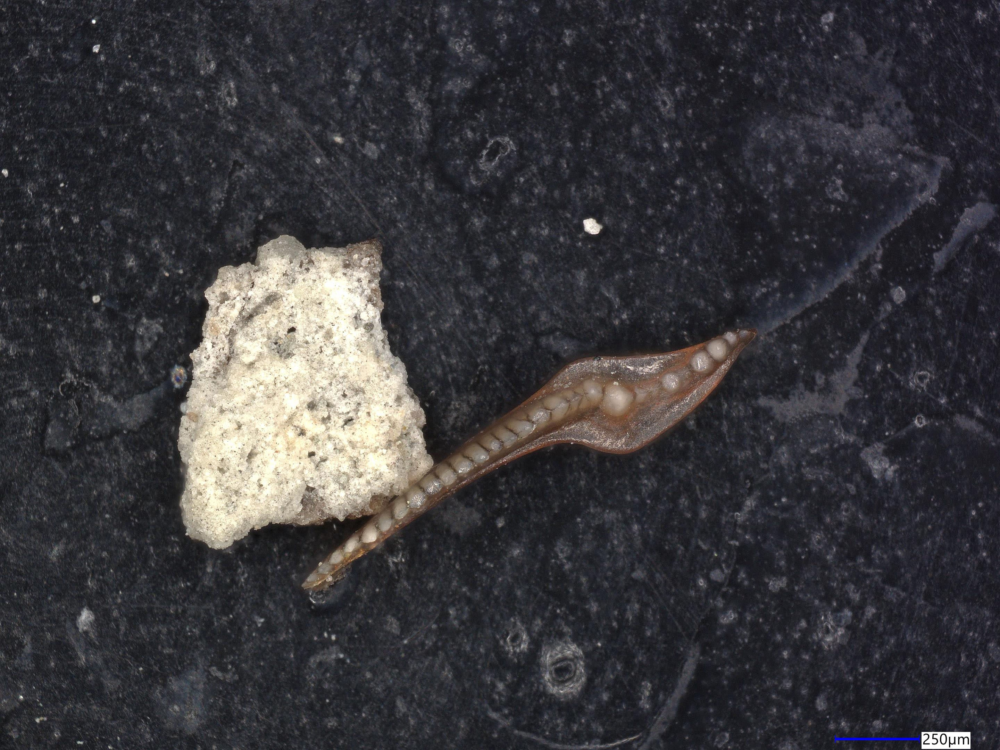
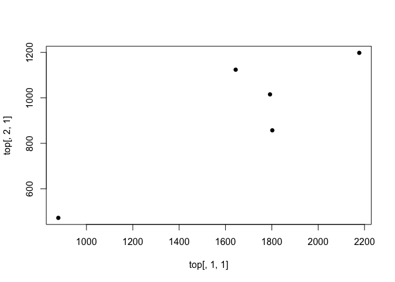
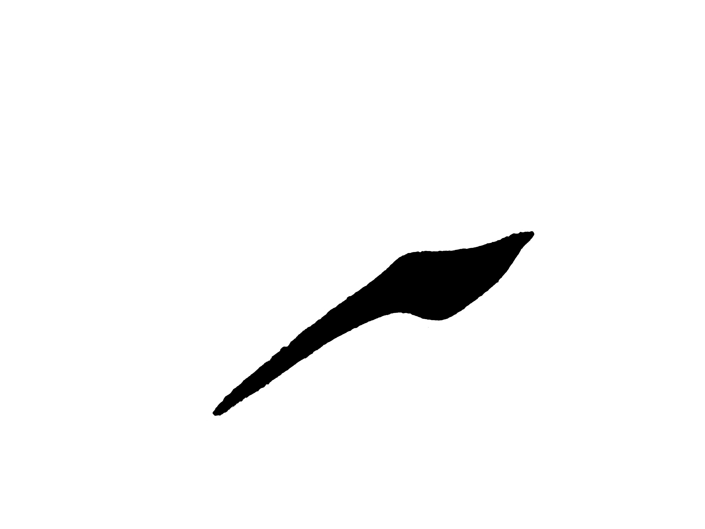
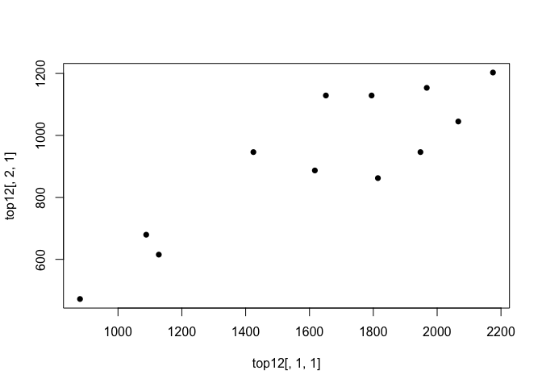
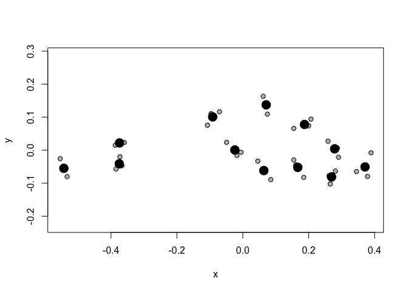
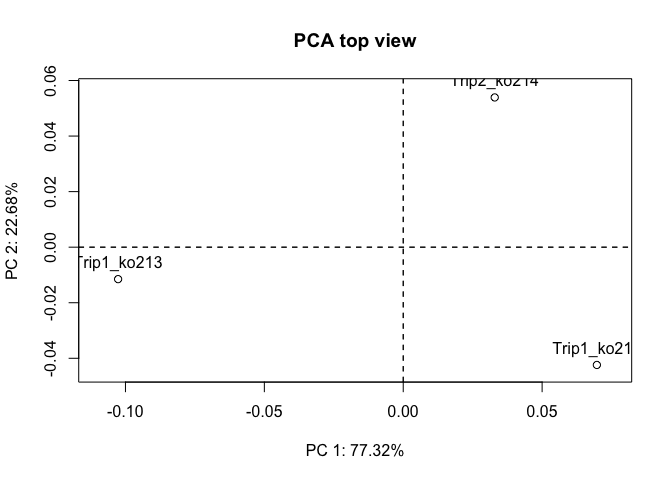

# A methodology for analyzing morphological evolution of Tripodellus
Emilia Jarochowska

## The goal

We would like to establish a set of landmarks that can be applied to
*Tripodellus*. It doesn’t have a lot of homologous points so Type I
landmarks are limited:



Instead, we probably need to use sliding landmarks to capture the
curvature of the element outline.

## Geomorph

This package does not provide options for importing the outline of an
image into xy coordinates, but allows interactive selection of Type I
landmarks. So we can directly digitize the figure above, but only a few
points on it can be objectively distinguished as homologous. Here I used
5. I only show you the code but it is not executed, hence `eval: FALSE`.

``` r
geomorph::digitize2d(
  filelist="Trip1_ko213.jpg",
  nlandmarks=15,
  scale = NULL,
  tpsfile="top15.tps",
  MultScale = FALSE,
  verbose = TRUE
)
```

The landmarks are saved into `top.tps`. It can be read back into R
using:

``` r
top <- readland.tps(file="top.tps")
```


    No specID provided; specimens will be numbered 1, 2, 3 ...

    No curves detected; all points appear to be fixed landmarks.

    Warning in readland.tps(file = "top.tps"): Not all specimens have scale adjustment (perhaps because they are already scaled); 
    no rescaling will be performed in these cases

``` r
plot(x = top[,1,1],
     y = top[,2,1], 
     pch = 16)
```



That really isn’t a lot to go by. Let us try to extract the outline into
a xy matrix.

## Momocs

This package can turn an image into coordinates but it has to be a black
outline on a white background. I did it in Photoshop, in a relatively
time-consuming way. This might need to be optimized.



``` r
Ko213_1 <- Momocs::import_jpg("Trip1_ko213_bw.jpg",
                  auto.notcentered = TRUE)
```

    Extracting 1.jpg outlines...

    [ 1 / 1 ]  Trip1_ko213_bw.jpg

    Done in 0.3 secs

``` r
plot(Ko213_1$Trip1_ko213_bw,
     col = rainbow(nrow(Ko213_1$Trip1_ko213_bw)))

points(x = top[,1,],
       y = top[,2,],
       col = "black",
       pch = 16)
```


This gave us 2804 landmarks (need to find how to evaluate in-line
expressions in Quarto). That might be too many. We need a comparable
number between specimens. We could subsample these landmarks to a
reasonable number using the `runif` function that samples from a uniform
distribution.

``` r
Ko213_1_100 <- Ko213_1$Trip1_ko213_bw[runif(300,
                                   min = 1,
                                   max = nrow(Ko213_1$Trip1_ko213_bw)),]

plot(Ko213_1_100)
```


But these landmarks are not very well spaced. Maybe we need to get back
to `geomorph` and use the function `define.sliders`. The problem with
`geomorph` is that it’s not well documented. [`Momocs` is pretty
good.](https://momx.github.io/Momocs/articles/Momocs_intro.html)

But maybe we prefer to use Fourier transform instead? To be discussed
with Robin, Twan, Przemek and Niklas.

## Sliding landmarks in geomorph

Here I digitize 12 landmarks, of which 5 are Type I.

``` r
ko <- list.files(pattern = "*.jpg")

geomorph::digitize2d(
  filelist=ko,
  nlandmarks=12,
  scale = NULL,
  tpsfile="top15.tps",
  MultScale = FALSE,
  verbose = TRUE
)
```

How to make the remaining ones sliding landmarks?

``` r
top12 <- readland.tps(file="top15.tps")
```


    No specID provided; specimens will be numbered 1, 2, 3 ...

    No curves detected; all points appear to be fixed landmarks.

    Warning in readland.tps(file = "top15.tps"): Not all specimens have scale adjustment (perhaps because they are already scaled); 
    no rescaling will be performed in these cases

``` r
plot(x = top12[,1,1],
     y = top12[,2,1], 
     pch = 16)
```



``` r
define.sliders(landmarks = top12, 
               nsliders = 7, 
               write.file = TRUE)
```

After some clicking in interactive mode, which cannot be shown in Quarto
and needs to be done directly in R, a file called `curveslide.csv` is
saved and can be used in future analyses. Now we can digitize two more
specimens. Important is to always use the same number of landmarks and
place them in the same order.

``` r
top.gpa<-gpagen(top12)
```


    Performing GPA

      |                                                                            
      |                                                                      |   0%
      |                                                                            
      |==================                                                    |  25%
      |                                                                            
      |===================================                                   |  50%
      |                                                                            
      |======================================================================| 100%

    Making projections... Finished!

``` r
top.gpa$links <- define.links(top.gpa$coords[,,1])
```

``` r
plotAllSpecimens(top.gpa$coords,
                 links = top.gpa$links)
```



``` r
top.PCA <- gm.prcomp(top.gpa$coords)
plot(top.PCA, 
     main = "PCA top view")
text(top.PCA$x[,1], 
     top.PCA$x[,2], 
     labels = c("Trip1_ko213", "Trip1_ko214", "Trip2_ko214"),
     offset = 0.6,
     pos = 3)
```


