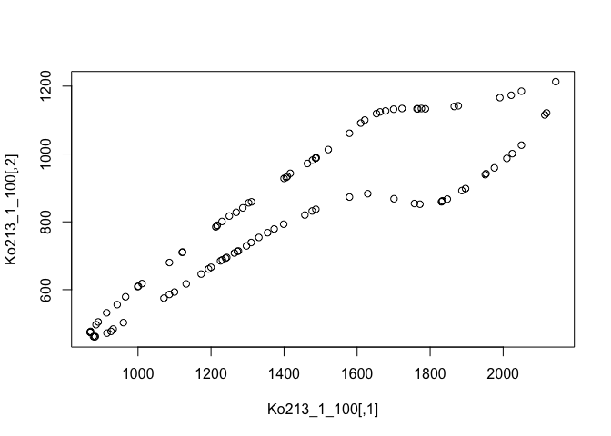

# A methodology for analyzing morphological evolution of Tripodellus
Emilia Jarochowska

## The goal

We would like to establish a set of landmarks that can be applied to
*Tripodellus*. It doesn’t have a lot of homologous points so Type I
landmarks are limited:


Instead, we probably need to use sliding landmarks to capture the
curvature of the element outline.

## Geomorph

This package does not provide options for importing the outline of an
image into xy coordinates, but allows interactive selection of Type I
landmarks. So we can directly digitize the figure above, but only a few
points on it can be objectively distinguished as homologous. Here I used
5. I only show you the code but it is not executed, hence `eval: FALSE`.

``` r
geomorph::digitize2d(
  filelist="Trip1_ko213.jpg",
  nlandmarks=5,
  scale = NULL,
  tpsfile="top.tps",
  MultScale = FALSE,
  verbose = TRUE
)
```

The landmarks are saved into `top.tps`. It can be read back into R
using:

``` r
top <- readland.tps(file="top.tps")
```


    No specID provided; specimens will be numbered 1, 2, 3 ...

    No curves detected; all points appear to be fixed landmarks.

    Warning in readland.tps(file = "top.tps"): Not all specimens have scale adjustment (perhaps because they are already scaled); 
    no rescaling will be performed in these cases

``` r
plot(x = top[,1,1],
     y = top[,2,1], 
     pch = 16)
```


That really isn’t a lot to go by. Let us try to extract the outline into
a xy matrix.

## Momocs

This package can turn an image into coordinates but it has to be a black
outline on a white background. I did it in Photoshop, in a relatively
time-consuming way. This might need to be optimized.


``` r
Ko213_1 <- Momocs::import_jpg("Trip1_ko213_bw.jpg",
                  auto.notcentered = TRUE)
```

    Extracting 1.jpg outlines...

    [ 1 / 1 ]  Trip1_ko213_bw.jpg

    Done in 0.3 secs

``` r
plot(Ko213_1$Trip1_ko213_bw,
     col = rainbow(nrow(Ko213_1$Trip1_ko213_bw)))

points(x = top[,1,],
       y = top[,2,],
       col = "black",
       pch = 16)
```


This gave us 2804 landmarks (need to find how to evaluate in-line
expressions in Quarto). That might be too many. We need a comparable
number between specimens. We could subsample these landmarks to a
reasonable number using the `runif` function that samples from a uniform
distribution.

``` r
Ko213_1_100 <- Ko213_1$Trip1_ko213_bw[runif(100,
                                   min = 1,
                                   max = nrow(Ko213_1$Trip1_ko213_bw)),]

plot(Ko213_1_100)
```



But these landmarks are not very well spaced. Maybe we need to get back
to `geomorph` and use the function `define.sliders`. The problem with
`geomorph` is that it’s not well documented. [`Momocs` is pretty
good.](https://momx.github.io/Momocs/articles/Momocs_intro.html)

But maybe we prefer to use Fourier transform instead? To be discussed
with Robin, Twan, Przemek and Niklas.
